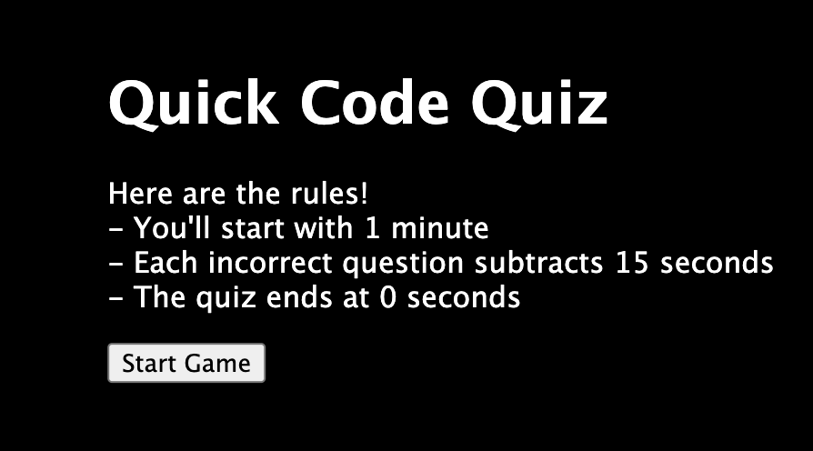
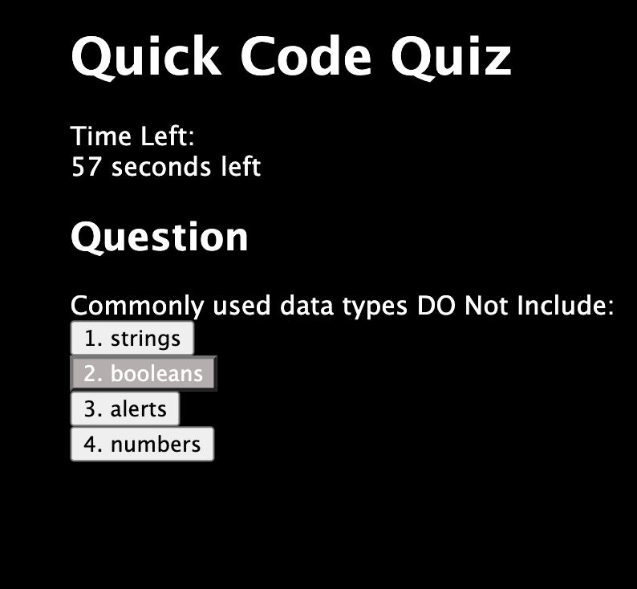
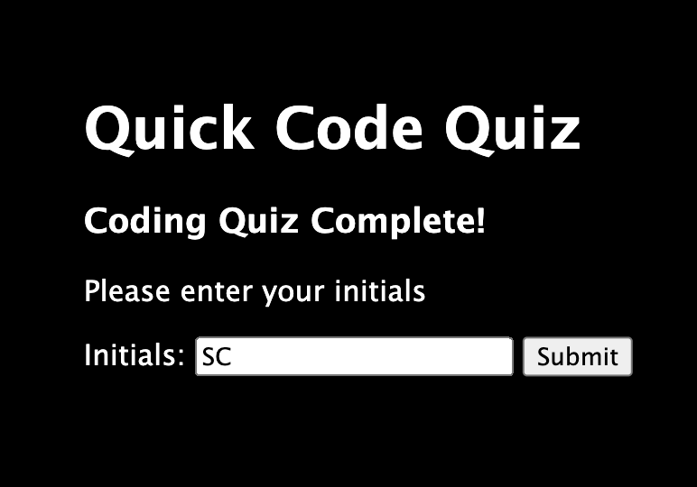
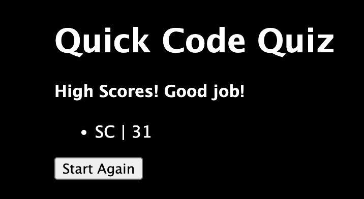

# Quick Code Quiz

## Description

I built this to explore javascript more intimately, and get familiar with local storage. I wanted to challenge myself to make a clean, simple, but interactive quiz that is both informational and challenging, given the time element. I learned a lot about functions and methods, and I learned I need a lot more time with these languages to make it elegent and not just functional. There's a lot of code that repeats, but that was the only way I could wrap my brain around executing this many interdepentant functions. I hope to return and refactor it soon, as well as add a CSS framework.

## Installation

No installation necessary, just visit https://chamberssarahann.github.io/Quick_code_quiz/ on your web browser while connected to the internet. 

## Usage
1. Read the rules and prest 'Start'

2. Answer questions until quiz ends, or time runs out

3. Enter your initials after quiz ends

4. See your score, and takes the test again if you like

## Credits

Special thanks to Sarun Thunyapauksanon (GitHub link to follow), who is a very good explainer and coding helper when I get stuck. He never gives me the answer, but always helps me find it.

## License

MIT License

Copyright (c) 2024 Sarah Chambers

Permission is hereby granted, free of charge, to any person obtaining a copy
of this software and associated documentation files (the "Software"), to deal
in the Software without restriction, including without limitation the rights
to use, copy, modify, merge, publish, distribute, sublicense, and/or sell
copies of the Software, and to permit persons to whom the Software is
furnished to do so, subject to the following conditions:

The above copyright notice and this permission notice shall be included in all
copies or substantial portions of the Software.

THE SOFTWARE IS PROVIDED "AS IS", WITHOUT WARRANTY OF ANY KIND, EXPRESS OR
IMPLIED, INCLUDING BUT NOT LIMITED TO THE WARRANTIES OF MERCHANTABILITY,
FITNESS FOR A PARTICULAR PURPOSE AND NONINFRINGEMENT. IN NO EVENT SHALL THE
AUTHORS OR COPYRIGHT HOLDERS BE LIABLE FOR ANY CLAIM, DAMAGES OR OTHER
LIABILITY, WHETHER IN AN ACTION OF CONTRACT, TORT OR OTHERWISE, ARISING FROM,
OUT OF OR IN CONNECTION WITH THE SOFTWARE OR THE USE OR OTHER DEALINGS IN THE
SOFTWARE.